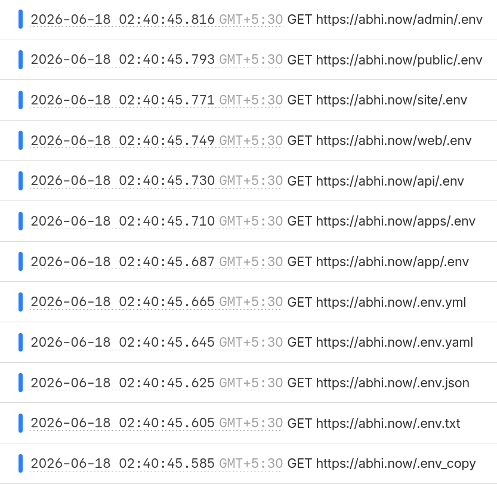

I've been a happy Cloudflare freeloader[^1] for about a year now. If you've ever tracked requests going through your domains (with Observability or something else), you have probably seen requests similar to these.



In my case -- a static [Astro](https://astro.build/) site deployed on Cloudflare -- all of these requests will return a 404. But they are still _hits_, and will still be counted towards the Worker's [billing cycle of 100K requests per day](https://developers.cloudflare.com/workers/platform/pricing/#workers). It's a lot of dead traffic from some poor bot trying to fingerprint the site, and I'd rather it not reach my Worker at all.

Cloudflare, funnily enough, already provides a pretty good solution with [Security Rules](https://developers.cloudflare.com/security/rules/) (or more specifically, [Custom WAF Rules](https://developers.cloudflare.com/waf/custom-rules/create-dashboard/#rule-form)). Using a custom domain with a Worker already requires you to onboard your domain onto Cloudflare. Due to this, with something as minimal as the Free Plan, you still get access to adding upto 5 Custom Rules to your domain!

After a lot of skimming through the hit patterns and converting the expressions to wildcards, I ended up with this filter.

```
(http.request.uri.path wildcard r"*/.env*") or
(http.request.uri.path wildcard r"*/.git*") or
(http.request.uri.path wildcard r"*/.svn*") or
(http.request.uri.path wildcard r"*/.htaccess*") or
(http.request.uri.path wildcard r"*/web.config*") or
(http.request.uri.path wildcard r"*/.aws*") or
(http.request.uri.path wildcard r"*/.ssh*") or
(http.request.uri.path wildcard r"*/wp-*") or
(http.request.uri.path wildcard r"*/xmlrpc*") or
(http.request.uri.path wildcard r"*/phpmyadmin*") or
(http.request.uri.path wildcard r"*/phpinfo*") or
(http.request.uri.path wildcard r"*.php") or
(http.request.uri.path wildcard r"*.yml") or
(http.request.uri.path wildcard r"*.yaml") or
(http.request.uri.path wildcard r"*.toml") or
(http.request.uri.path wildcard r"*.ini") or
(http.request.uri.path wildcard r"*.bak") or
(http.request.uri.path wildcard r"*.sql") or
(http.request.uri.path wildcard r"*.tar*") or
(http.request.uri.path wildcard r"*.zip")
```

Implementing this immediately made the traffic a lot calmer, and the visitor graphs a lot simpler.

Now, it's definitely a pain to do a large expression like this through the UI. And if you're a maniac like me, you own multiple domains that you'd have to set this up for. In that case, here's a quickly vibed-up script[^2] for you to run across your zones. Execute at your own risk! :P

```mjs title="apply-waf.mjs"
import { readFileSync } from "fs";

// Load .env manually (no dotenv dep needed)
try {
	const env = readFileSync(".env", "utf8");
	for (const line of env.split("\n")) {
		const [key, ...rest] = line.split("=");
		if (key && rest.length) process.env[key.trim()] = rest.join("=").trim();
	}
} catch {}

const TOKEN = process.env.CF_API_TOKEN;
const ACCOUNT_ID = process.env.CF_ACCOUNT_ID;

if (!TOKEN || !ACCOUNT_ID) {
	console.error("Missing CF_API_TOKEN or CF_ACCOUNT_ID");
	process.exit(1);
}

const c = {
	reset: "\x1b[0m",
	bold: "\x1b[1m",
	dim: "\x1b[2m",
	red: "\x1b[31m",
	green: "\x1b[32m",
	yellow: "\x1b[33m",
	blue: "\x1b[34m",
	cyan: "\x1b[36m",
	white: "\x1b[37m",
};

const log = {
	info: (msg) => console.log(`${c.blue}info${c.reset}  ${msg}`),
	ok: (msg) => console.log(`${c.green}ok${c.reset}    ${msg}`),
	skip: (msg) => console.log(`${c.yellow}skip${c.reset}  ${msg}`),
	error: (msg) => console.error(`${c.red}error${c.reset} ${msg}`),
	zone: (msg) => console.log(`\n${c.bold}${c.cyan}zone${c.reset}  ${c.bold}${msg}${c.reset}`),
	dim: (msg) => console.log(`${c.dim}${msg}${c.reset}`),
};

const RULE_DESCRIPTION = "Block scanner/malicious paths";

const WAF_EXPRESSION = [
	`(http.request.uri.path wildcard r"*/.env*")`,
	`(http.request.uri.path wildcard r"*/.git*")`,
	`(http.request.uri.path wildcard r"*/.svn*")`,
	`(http.request.uri.path wildcard r"*/.htaccess*")`,
	`(http.request.uri.path wildcard r"*/web.config*")`,
	`(http.request.uri.path wildcard r"*/.aws*")`,
	`(http.request.uri.path wildcard r"*/.ssh*")`,
	`(http.request.uri.path wildcard r"*/wp-*")`,
	`(http.request.uri.path wildcard r"*/xmlrpc*")`,
	`(http.request.uri.path wildcard r"*/phpmyadmin*")`,
	`(http.request.uri.path wildcard r"*/phpinfo*")`,
	`(http.request.uri.path wildcard r"*.php")`,
	`(http.request.uri.path wildcard r"*.yml")`,
	`(http.request.uri.path wildcard r"*.yaml")`,
	`(http.request.uri.path wildcard r"*.toml")`,
	`(http.request.uri.path wildcard r"*.ini")`,
	`(http.request.uri.path wildcard r"*.bak")`,
	`(http.request.uri.path wildcard r"*.sql")`,
	`(http.request.uri.path wildcard r"*.tar*")`,
	`(http.request.uri.path wildcard r"*.zip")`,
].join(" or ");

const HEADERS = {
	Authorization: `Bearer ${TOKEN}`,
	"Content-Type": "application/json",
};

async function cfFetch(path, opts = {}) {
	const res = await fetch(`https://api.cloudflare.com/client/v4${path}`, {
		headers: HEADERS,
		...opts,
	});
	return { status: res.status, body: await res.json() };
}

async function getAllZones() {
	const zones = [];
	let page = 1;

	while (true) {
		const { body } = await cfFetch(
			`/zones?account.id=${ACCOUNT_ID}&status=active&per_page=50&page=${page}`
		);

		if (!body.success) {
			log.error(`Failed to fetch zones: ${JSON.stringify(body.errors)}`);
			process.exit(1);
		}

		zones.push(...body.result);

		const { total_pages } = body.result_info;
		if (page >= total_pages) break;
		page++;
	}

	return zones;
}

async function applyRuleToZone(zoneId) {
	const phase = "http_request_firewall_custom";

	const { status, body: entrypoint } = await cfFetch(
		`/zones/${zoneId}/rulesets/phases/${phase}/entrypoint`
	);

	if (status === 200) {
		const existing = entrypoint.result?.rules?.find((r) => r.description === RULE_DESCRIPTION);

		if (existing) {
			log.skip("rule already exists");
			return;
		}

		const rulesetId = entrypoint.result.id;
		const { body: addResult } = await cfFetch(`/zones/${zoneId}/rulesets/${rulesetId}/rules`, {
			method: "POST",
			body: JSON.stringify({
				action: "block",
				expression: WAF_EXPRESSION,
				description: RULE_DESCRIPTION,
				enabled: true,
			}),
		});

		if (!addResult.success) {
			log.error(`failed to add rule: ${JSON.stringify(addResult.errors)}`);
		} else {
			log.ok("rule added");
		}
	} else if (status === 404) {
		const { body: createResult } = await cfFetch(`/zones/${zoneId}/rulesets`, {
			method: "POST",
			body: JSON.stringify({
				name: "zone",
				description: "Zone-level WAF custom rules",
				kind: "zone",
				phase,
				rules: [
					{
						action: "block",
						expression: WAF_EXPRESSION,
						description: RULE_DESCRIPTION,
						enabled: true,
					},
				],
			}),
		});

		if (!createResult.success) {
			log.error(`failed to create ruleset: ${JSON.stringify(createResult.errors)}`);
		} else {
			log.ok("ruleset created with rule");
		}
	} else {
		log.error(`unexpected status ${status}`);
	}
}

async function main() {
	log.info("fetching zones...");
	const zones = await getAllZones();
	log.info(`found ${zones.length} zone(s)`);

	for (const zone of zones) {
		log.zone(`${zone.name} ${c.dim}(${zone.id})${c.reset}`);
		await applyRuleToZone(zone.id);
	}

	console.log(`\n${c.bold}done.${c.reset}`);
}

main();
```

The above script requires the following environment variables to be set. You can find your Account ID through [this guide](https://developers.cloudflare.com/fundamentals/account/find-account-and-zone-ids/#copy-your-account-id), and create an API token (with the "Zone.Zone WAF:Edit" and "Zone.Zone:Read" permissions) according to [the instructions here](https://developers.cloudflare.com/fundamentals/api/get-started/create-token/).

```sh ".env"
CF_API_TOKEN=your_token_here
CF_ACCOUNT_ID=your_account_id_here
```

[^1]: And a "payloader", I have some Workers running on the Paid plan. :P

[^2]: I would try to use Wrangler for automating this, but it seems like WAF Rule changing can only be done through API requests.
